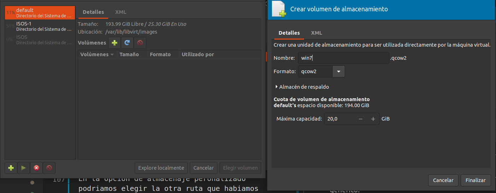
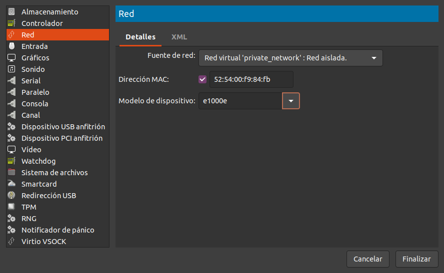

# QUE ES KVM?
La máquina virtual basada en el kernel es una tecnología de virtualización de open source integrada a Linux.Con KVM puede convertir a Linux en un hipervisor que permite que una máquina de host ejecute entornos virtuales múltiples y aislados llamados máquinas virtuales o huéspedes.

KVM convierte a Linux en un hipervisor de tipo 1. Todos los hipervisores necesitan algunos componentes al nivel del sistema operativo (por ejemplo, administrador de memoria, planificador de procesos, pila de entrada o salida (E/S), controladores de dispositivos, gestión de seguridad, pila de red y más) para ejecutar las máquinas virtuales. KVM cuenta con todos estos componentes porque es parte del kernel de Linux. Cada máquina virtual se implementa como un proceso regular de Linux, programada por el planificador estándar de Linux con hardware virtual dedicado como tarjeta de red, adaptador de gráficos, CPU, memoria y discos.

# INSTALACION DE KVM.

Para la isntalacion de ubutu deberiamos instalar los siguientes paquetes.
```
apt install -y qemu qemu-kvm libvirt-daemon libvirt-clients bridge-utils virt-manager
```

Deberiamos activar el servicio de `libvirt`(Servicio que controla KVM)
```
systemctl enable --now libvirtd
```

Y tambien deberiamos asignar a un usuario al grupo de `libvirt` para que no hagamos todos los procesos de instalar maquianas y tal con el root.
```
usermod -G libvirt $USER
```

Reiniciar el servicio de `libvirt`.
```
service libvirtd restart
```

Por ultimo iniciar la aplicacion en la que podremos administrarlo todo `Gestor de maquinas virtuales`


# REDES VIRTUALES Y ALMACENAMIENTO.

## REDES VIRTUALES

Antes de la puesta en marcha de maquinas virtuales es bueno saber que se pueden crear varias redes virtuales tambien, para hacer con ellas lo que queramos, en el `gestor de maquinas virtuales > editar > detalles de la conexion > redes virtuales` encontramos el gestor.


La red que nos sale es la que por defecto crea KVM, es una red NAT que si nos fijamos es la `192.168.122.0/24` y tiene un rango que es entre el `192.168.122.2` a `192.168.122.254` vemos que la `192.168.122.1` no la pone porque sera el mismo KVM el que la tenga, para hacer un `NAT` y tener tanto internet como conexion con las maquinas reales.

Pero no es solo capaz de hacer un `NAT` podemos hacer una de las siguientes

- `NAT`
    - Crea una red y hace de traductor enviandolo al dispositivo fisico para que tenga internet y conexion con red local fisica.
- `ENRUTADA`
    - Esta seria como un puente, hay un switch virtual que conecta las maquinas virtuales directamente al router.
- `ISOLATED`
    - En este caso la red pasaria a no tener acceso a internet, solamente tendria conexion con las maquinas virtuales que tengan tambien acceso a esta.

Puedes seleccionar el modo y el dispositivo fisico que quieras para cada una de las conexiones y tambien un rango de IPs personalizado.


## ALAMCENAMIENTO

En el apartado de alamcenamiento podremos agregar los directorios de maquina  virtual que usaremos para o bien guardar los discos duros virtuales o tambien para seleccionar la carpeta donde tendremos las `ISOS` de instalacion de los `SSOO` `gestor de maquinas virtuales > editar > detalles de la conexion > Almacenamiento`


La que tenemos por defecto es donde se guardaran los discos duros de las maquinas virutales, en `KVM` el espacio de un disco duro virtual se asigna entero, no existe la opcion de reservarlo dinamicamente segun lo que ocupe la maquina.

En el caso por defecto los discos duros virtuales se guardan en `var/lib/libvirt/images/` Si queremos que se guarden en otro lugar lo suyo es agregarlo aqui y cuando se instale la maquina se puede cambiar donde se guardara, tambien se podria cambiar una vez instalada la maquina cambiandolo desde los ajustes y moviendo el archivo de un sitio a otro.

# PREPARACION Y CONFIGURACION DE UNA MAQUINA VIRTUAL.

## PREPARACION DE LA MAQUINA VIRTUAL.

Para comenzar nos vamos al gestor y le damos a una nueva. 


Tenemos los distintos modos de instalacion que podemos hacer desde `KVM`:

- Mediante un archivo `ISO` o `CDROM`
    -  Es la forma mas estandar de isntalar un Sistema Operativo, mediante una imagen o un CD.

- Instalcion de red (https. http, ftp)
    - Esta instalacion esta preparada para que `KVM` se conecte a un servidor y le proporcione el sistema operativo mediante la RED.

- Arranque por RED
    - Es muy parecido a Instalacion de red solo que aqui el servidor es un servidor local al que el equipo fisico esta conectado mediante el cable de red.

- Importar imagen de disco existente.
    - Importacion de una maquina ya creada antes.


Segun la ISO o demas que escojamos necesita saber que sistema operativo se le va a instalar, suele reconocerlo solo, pero sino, hay que ponerselo manual, aunque sea un sistema generico.


Se le asiga la RAM y CPU que queramos y el almacenamiento.


En la opcion de almacenaje peronalizado podriamos elegir la otra ruta que habiamos creado en el apartado anterior, y crear una imagen de disco en ese directorio fisico.



Ya solo nos quedaria por asignarle la red que va a utilizar pero podriamos configurarlo mucho mas, en el siguiente resumen mejor pulsar el `configurar antes de instalar` y la red que queremos usar (Si es mas de una podemos agregar mas adelante)


Al finalizar nos sale la ventana con todas las configuraciones de "Hardware" que le podemos hacer a la maquina.


Para por ejemplo agregar la otra red que hemos creado antes seria abajo donde pone agregar hardware.

En esta ventana podemos agregar un monton de cosas como una nueva red, un nuevo disco, una nueva pantalla entre otras.



Cuando acabemos la agregamos y vemos como nos sale un nuevo apartado de red (NIC) en la ventada de antes de configuracion.

